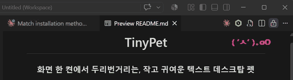

<div align="right">

[한국어](README.md) · **English**

</div>

<div align="center">

# TinyPet

### A small, cute text desktop pet that peeks around the corner of your screen

Boring work, a lifeless cubicle, a painful desk.

Aren't you suppressing the stress and the urge to escape?

Quietly inside your screen, a tiny friend looks around, dozes off, and sometimes even flips a table — becoming your secret little comfort, with no one the wiser.

**✨ Raise a small cute text pet on your desktop ✨**

[](https://www.python.org/)
[](LICENSE)
[](#installation)
[-success.svg)](https://docs.python.org/3/library/tkinter.html)



```
   ( ˙ㅅ˙ )            ( ˙ㅅ˙ )ノ            ( ˘ㅅ˘ )zzZ
   looks around        waves when clicked     dozes off after 90s
```

```
   (♡ㅅ♡ )            (╯｀ㅅ´)╯︵┻━┻          ( @ㅅ@ )～
   hearts when adored   ???: table flip   ???: dizzy
```

</div>

- **Transparent overlay** floating above other windows (Win: true transparency / macOS: system transparent / Linux: translucent)
- **39 text animations** — peek / jump / hearts / dance / peek-a-boo / selfie / running ...
- **Reactive interactions** — click / rapid spam (angry · table flip) / shake (dizzy) / drag
- **Wakes from PC lock/sleep** in a sleeping pose
- **User-defined roam area** via right-click
- **Color & speed customization** with auto-saved settings (`~/.tinypet.json`)
- **Cross-platform**: Windows / macOS / Linux

---

## Installation

Pick whichever fits you. Full guide: [docs/INSTALL.en.md](docs/INSTALL.en.md)

### A. Click-to-Run (easiest)

No Python required. Download from [Releases](https://github.com/juneilsam/tinypet/releases):

| Platform | File | How to run |
|---|---|---|
| Windows | `TinyPet.exe` | Double-click |
| macOS | `TinyPet-macos.zip` | Unzip and double-click `TinyPet.app` |
| Linux | (use pip or build) | See B/C |

### B. pip install — Python users

```bash
pip install git+https://github.com/juneilsam/tinypet.git
tinypet
```

### C. Clone & Run — developers / local execution

```bash
git clone https://github.com/juneilsam/tinypet.git
cd tinypet

run.bat           # Windows
./run.sh          # macOS / Linux
```

Manual:
```bash
pip install -r requirements.txt
python -m tinypet     # Windows
python3 -m tinypet    # macOS / Linux
```

**Extra permission on macOS**: Global key/mouse detection (`pynput`) needs *System Settings → Privacy & Security → Accessibility* — enable your Terminal (or TinyPet.app).

---

## Usage

A mouse is all you need — click for a greeting, shake it dizzy, and bully it too much and it flips a table. Details: [docs/USAGE.en.md](docs/USAGE.en.md)

### Interactions

| Action | Effect |
|---|---|
| Left-click pet | Wave / hearts / smile (cycles on each click) |
| ??? | Angry → cools down |
| ??? | Table-flip easter egg |
| ??? | Dizzy |
| Drag pet | Move position (auto-saved) |
| Right-click pet | Menu |
| Any key (while asleep) | Wakes up |
| Click elsewhere (while asleep) | Startled |
| 90s idle | Dozes off |
| Wake from PC lock/sleep | Greets you sleeping |

### Right-click menu

- **Roam area ↖/↘** — Drag pet to a corner, right-click to set as that corner of the box
- **Text color** — 7 presets + custom (color picker)
- **Speed** — Very slow ~ very fast (5 steps)
- **Wake up now / Sleep now** — Force state
- **Reset settings** — Back to defaults
- **Quit**

---

## Settings file

Location: `~/.tinypet.json` (Windows: `C:\Users\<user>\.tinypet.json`)

```json
{
  "fg_color": "#222222",
  "speed": 1.0,
  "speed_key": "normal",
  "roam_box": [1680, 40, 1880, 180],
  "last_position": [1750, 100]
}
```

Saved when: color / speed / roam-area change, drag to move, clean quit. Auto-moved positions are NOT saved.

---

## Auto-start

Register once, and it quietly clocks in with you on every boot.

- **Windows**: `Win+R` → `shell:startup` → drop a **shortcut** to `TinyPet.exe` (or `run.bat`) into that folder
- **macOS**: System Settings → General → Login Items → `+` → `TinyPet.app`
- **Linux**: add a `.desktop` file to your DE's autostart folder (usually `~/.config/autostart/`)

---

## FAQ

**Q. Safe on a work PC?**
The overlay window itself is harmless, but the global keyhook (`pynput`) may be blocked by corporate EDR. Even if blocked, the pet still works (direct clicks only).

**Q. How do I hide it during screen sharing?**
Right-click → Quit. It's always-on-top, so kill it before meetings.

**Q. Does it work on macOS / Linux?**
Yes. Transparency handling differs per platform:
- **Windows**: magenta pixels rendered truly transparent (only text visible)
- **macOS**: `wm_attributes('-transparent')` + `bg='systemTransparent'` (true transparent)
- **Linux**: per-color transparency is hard → falls back to translucent window (`-alpha 0.9`)
macOS needs Accessibility permission for pynput. Linux needs a working compositor (KWin / Mutter / etc.) for alpha to apply.

**Q. Characters look broken (□ boxes).**
Default fonts differ per platform (Win: Malgun Gothic / macOS: Apple SD Gothic Neo / Linux: Noto Sans CJK KR). Change `DEFAULT_FONT` in `tinypet/pet.py` to another installed font.

---

## Development

See [docs/DEVELOPMENT.en.md](docs/DEVELOPMENT.en.md) for builds, adding animations, release process.

```bash
git clone https://github.com/juneilsam/tinypet.git
cd tinypet
pip install -e ".[build]"
python -m tinypet
```

---

## Changelog

[CHANGELOG.md](CHANGELOG.md)

## License

[MIT](LICENSE)

---

Bug reports and issues are always welcome.
